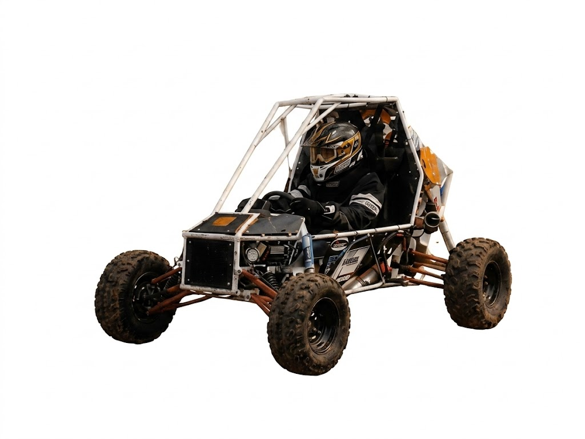

Stop everything. Do not plan. Do not ask questions. Open index.html right now and make these exact edits.
EDIT 1 — Find this line:
html
or whatever the current img tag for photo2_edited.png looks like. Delete that entire line.
EDIT 2 — Find the about section — the block containing "A LEGACY BUILT ON DIRT" and the paragraph about SRM University. Delete that entire section.
EDIT 3 — In their place, paste this exact HTML block:
html

  

    
    

  

  

    

    

      THE TEAM
      <h2 style="font-family:'Bebas Neue',sans-serif; font-size:clamp(56px,6vw,100px); color:#F0EDE8; line-height:0.95; margin-bottom:28px;">A LEGACY BUILT ON DIRT</h2>
      
The Conrods is one of the most well-established teams at SRM University, renowned for its strong presence and consistent performance in racing events over the years. With a legacy built on dedication and innovation, the team has earned a significant name in the BAJA community. Now, with a fresh start after four years, the team is focused on rebuilding its vehicle from the ground up, aiming to come back stronger and push the limits of engineering and performance.

    

  

EDIT 4 — Find the closing </body> tag. Directly above it, paste this exact script block:
html
Save the file. Deploy to Vercel. Do not change anything else.
