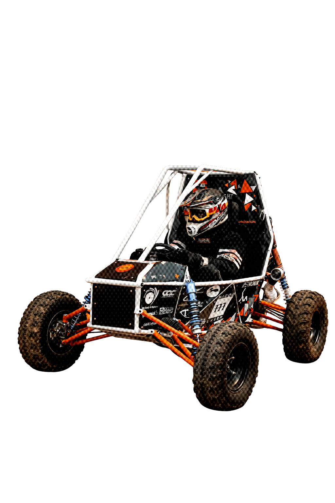

The exact behaviour I want:
The hero section (photo_1.jpg background) is Page 1. As soon as the user starts scrolling down from the hero, the car (photo_2.png) must be visible on the hero itself — sitting in the center or right side of the hero — and as the user scrolls it moves downward and to the left simultaneously, landing on the left half of the next section. When it finishes landing on the left, the right side reveals the "About The Conrods" text block. The car and the text end up side by side — car left, text right — like a split layout.
This is a two-phase scroll sequence:
Phase 1 — Car visible on hero, user hasn't scrolled yet:
The car (photo_2.png) is already visible on the right side of the hero section, floating mid-frame. It is position: fixed during this phase. It starts at approximately top: 20vh; right: 5vw. Scale 0.9, rotation: -6deg. This gives the impression the car is in-flight on the hero page itself.
Phase 2 — User scrolls down:
As scroll begins, the car travels from its hero position (top: 20vh, right: 5vw) diagonally down and to the left, arriving at top: 50%, left: 5vw (vertically centered, left side of the about section). Simultaneously it levels out (rotation: 0), scales up to 1.0, and lands. The entire movement is driven by scrub: 2 — perfectly locked to scroll speed, no snapping.
Exact HTML structure:
html<!-- Car is outside all sections, fixed positioned -->

  
  

<!-- Hero Section -->
<section class="hero" id="hero">
  <!-- existing hero content stays exactly as is -->
</section>

<!-- About Section — this is where car lands -->
<section class="about-section" id="about">
  

    <!-- empty — car lands here visually via fixed positioning -->
  

  

    THE TEAM
    <h2>A LEGACY BUILT ON DIRT</h2>
    
The Conrods is one of the most well-established teams at SRM University, renowned for its strong presence and consistent performance in racing events over the years. With a legacy built on dedication and innovation, the team has earned a significant name in the BAJA community. Now, with a fresh start after four years, the team is focused on rebuilding its vehicle from the ground up, aiming to come back stronger and push the limits of engineering and performance.

  

</section>
CSS:
css#car-container {
  position: fixed;
  z-index: 100;
  pointer-events: none;
  will-change: transform;
  /* GSAP controls top/left/rotation/scale via transform */
}

#car-img {
  width: 520px;
  max-width: 45vw;
  display: block;
  mix-blend-mode: screen;
  filter: drop-shadow(0 40px 80px rgba(232,78,15,0.25));
  transform-origin: center bottom;
}

.about-section {
  min-height: 100vh;
  display: grid;
  grid-template-columns: 1fr 1fr;
  align-items: center;
  background: #080808;
  padding: 0 6vw;
  gap: 60px;
}

.about-right {
  opacity: 0; /* fades in when car lands */
}

.about-right h2 {
  font-family: 'Bebas Neue', sans-serif;
  font-size: clamp(48px, 6vw, 88px);
  color: #F0EDE8;
  margin-bottom: 24px;
  line-height: 1;
}

.about-right .section-label {
  font-family: 'Inter', sans-serif;
  font-size: 11px;
  letter-spacing: 0.25em;
  color: #E84E0F;
  text-transform: uppercase;
  display: block;
  margin-bottom: 16px;
}

.about-right p {
  font-family: 'Inter', sans-serif;
  font-size: 15px;
  line-height: 1.8;
  color: #8A8880;
  max-width: 480px;
}

.ground-line {
  position: absolute;
  bottom: -6px;
  left: 0; width: 100%;
  height: 1px;
  background: linear-gradient(to right, transparent, #E84E0F, transparent);
  opacity: 0;
}
GSAP — the scroll-driven movement. Copy this exactly:
jsgsap.registerPlugin(ScrollTrigger);

// Starting position — car floats on hero right side
// Use percentages of viewport so it works on all screen sizes
const vw = window.innerWidth;
const vh = window.innerHeight;

// Start: right side of hero, tilted, in flight
gsap.set('#car-container', {
  x: vw * 0.48,
  y: vh * 0.18,
  rotation: -6,
  scale: 0.88
});

// End: left side of about section, landed level
// Target: horizontally centered in left half, vertically centered in about section
const aboutSection = document.querySelector('.about-section');

const tl = gsap.timeline({
  scrollTrigger: {
    trigger: '#hero',
    start: 'top top',
    end: 'bottom top',
    scrub: 2,
    onLeave: () => {
      // Car has landed — reveal the about text
      gsap.to('.about-right', {
        opacity: 1,
        y: 0,
        duration: 0.8,
        ease: 'power2.out'
      });
      gsap.to('.ground-line', {
        opacity: 1, duration: 0.1,
        yoyo: true, repeat: 3
      });
    }
  }
});

tl.to('#car-container', {
  x: vw * 0.04,           // lands on left side
  y: vh * 0.28,           // vertically centered
  rotation: 0,            // levels out
  scale: 1.0,             // full size
  ease: 'power2.inOut'
});

// Set initial about-right state
gsap.set('.about-right', { opacity: 0, y: 30 });

// Recalculate on resize
window.addEventListener('resize', () => {
  ScrollTrigger.refresh();
});
Critical rules:

#car-container must be position: fixed and placed outside of both the hero and about sections in the DOM — it floats above everything
Do NOT put the car inside the sticky or hero div — it must be a sibling of all sections at the top level of <body>
mix-blend-mode: screen must stay on #car-img — this removes the black background
The about section left column stays empty in the DOM — the fixed car visually occupies it
scrub: 2 is non-negotiable — this is what makes the movement feel physically weighted and tied to scroll, not a time-based animation
On mobile (max-width: 768px): set #car-container to position: relative, disable all GSAP transforms, stack the about section to single column, car on top, text below

Deploy to Vercel when complete.